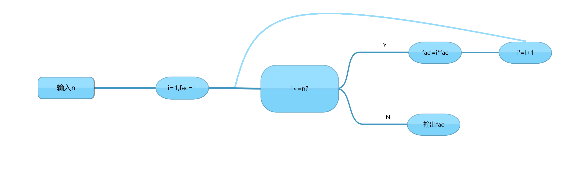

# 我的Python大数据学习路线

- Author @Heathcleff
- 参考书籍：余本国 -《基于Python的大数据分析基础及实战》
- 写于2020年5月
---

[TOC]

## Python语法基础

### 你好，Python！

本节Python脚本参见仓库中的*helloPython.py*。

在下面的示例程序中，您将看到以下演示内容：

| 内容 | 行数（范围）|
|:----:|:----:|
|编码设置|line 1|
|注释与多行注释|line 3-14|
|赋值与函数调用|line 16-19|
|循环结构|line 21-22|
|语句分行|line 24-35|
|标准输入函数与复杂调用标准输出函数|line 37-39|

```python
# -*- coding: utf-8 -*-

# helloPython.py
# Author @Heathcleff

'''
这是多行注释，注释在执行时并不会对被三个引号（单引号或双引号）包围起来的字段，
或以“#”号开头的行。
上面的“coding”字段为更改程序编码为UTF-8。
'''
"""
 Pycharm中可以显示为加粗字体，可以用来作为程序步的标志说明注释
这也是一种多行注释。
"""

str = "Hello, Python!"
print(max(1, 2, 3, 4))
print("a")
print(str)

for i in range(len(str)):
    print(str[i])

print("Python支持一个语句",
      "分多行书写，这样有很多好处。",
      "显而易见，这样书写使代码具有层次感，更加美观",
      "且如果将某函数的各项参数进行分行书写，",
      "也使程序易于修改和阅读。\n",
      "你所看到的是实现分行书写的一种方式。")
print("Python支持一个语句" \
      "分多行书写，这样有很多好处。" \
      "显而易见，这样书写使代码具有层次感，更加美观" \
      "且如果将某函数的各项参数进行分行书写，" \
      "也使程序易于修改和阅读。\n" \
      "你所看到的是实现分行书写的一种方式。")

name = input("Please enter your name:\n")
print("你好，", name, "，看到这种输出效果了吗？\n",
      "这就是标准输入函数和标准输出函数的复合使用效果。")
```
 首先，强烈建议您在进行编码时在脚本文件开头对编码形式进行声明。Python文件默认不支持中文输入，如果在Python脚本内直接输入中文，将出现乱码；若将编码格式更改为UTF-8（Unicode），Python文件内将可以输入中文。

关于注释，Python内支持单行注释和多行注释，养成一个良好的注释习惯对于任何一位计算机语言学习者来说都至关重要。
此外，您还可以在调试代码时将部分代码批量注释掉，这样，Python解释器只会读取没有被注释掉的部分，便于您了解程序错误的具体位置和部分代码的运行情况。

关于赋值与函数参数调用，Python内提供了非常简洁的语法，您可以很简单的将一个值、字符、字符串、一个变量甚至是一个视频的全部信息赋值给一个变量。
只需要很简单的一行命令：

```python
<var_name> = <something>
```
很简单，不是吗？但当您所赋的值为字符或字符串时，注意使用半角双引号或单引号将引用的字符包围起来，两组符号的区别如下：

|符号|意义|
|:----:|:----:|
|单引号|表示包围的是字符|
|双引号|表示包围的是字符串|
一旦您用单引号将字符串包围，解释器执行赋值时将仅读取字符串的第一个字符并赋值，因此您会损失出第一个字符以外的全部字符。

Python的函数允许嵌套，如您在第17行所见到的，我们在print()函数中嵌套了一个max()函数，所以相当于是调用print()函数将max()函数的**返回值**打印输出。

接下来来您将看到这样一个有趣的环节——循环体。请您在接下来的学习中务必掌握好循环体的书写与应用，这将是您编程中最常用到的一种结构，循环体支持嵌套，具体调用格式我们将在后面的章节进行详细的阐述，
您现在只需要知道，使用循环体，我们可以使特定的程序功能模块循环指定的次数或完成一定的判断功能，这对我们日后的数据分析（读取和写入）很有帮助。

接下来是成语语句的多行书写与静默输出。

如果您碰巧使用的是Python的解释器*Python.exe*进行代码实验，您就会发现，每当您键入一个指令，Python的解释器就会返回上一条键入指令的输出，有些情况下您可以使用Python交互式编辑器进行代码调试和特性测试工作
，但平时使用时如果看到这么多的输出提示是非常恼人的，这种情况下，您只需要在每个语句后（循环体等除外）加上半角字符“;”，您就能静默不必要的输出。
> **试一试**
>当您在print("Hello, world!")后面加上半角分号后，会发生什么呢？

使用在语句后面加半角分号也可以提示解释器该语句已经完成，
Python支持分行书写代码,您可以通过分行书写，增加代码美感，提高代码可读性，当您在书写一些多参数函数或输出长字符串时，您可以考虑这种多行输出的方式。

最后，您会认识Python的标准输入函数input，input函数会首先输出一个输入提示，然后等待用户输入，当用户键入回车时输入停止，请不要忘记将input函数读取的值赋给一个变量，否则输入将是无效的。
不过我们也可以将不赋值的input函数用作延迟程序模块，当程序主体完成运行后，程序本身并不会停止运行，此时input会等待用户键入回车后，程序才会终止。

好了，以上就是这个程序的全部要点了，由于本仓库的设置目标为对编程有一定基础，或以及对Python已经有一定了解，希望进一步学习Python数据分析模块的学习者，对于基础语法的讲解显得并没有详细，建议您在阅读本文档的基础上，访问[python官方中文文档](https://docs.python.org/zh-cn/3/)
，搜索相应的关键词进行学习。

此外，我强烈建议您能在学习每节代码的基础上，结合所学自己写一些小程序，这对您的与发熟练度大有裨益。

---

### 学会使用运算符
Python提供了海量的运算符以支持日常的数学计算需求。

这里用C和Python做对比，试图显示出Python在运算符上的丰富性和灵活性。

假设你希望让电脑计算一个乘方，假如你有一定的C语言基础，那么这时你也许会想到调用math.h库中的库函数`pow()`，而如果只允许用运算符进行运算的话，你可能会写出像下面这样的一堆代码(详见仓库中的multiplier.c)：

```C
/*
 * multiplier.c
 * author @zeshen
 * function -  Multiplier operation
*/

#include <stdio.h>
#include <stdlib.h>

int main(void){
        int x,y,i,a;
        printf("请输入底数:\n");
        scanf_s("%d",&x);
        a=x;
        printf("\n请输入指数:\n");
        scanf_s("%d",&y);

        for(i=1;i<y;i++){
                x=a*x;
        }
        printf("计算结果为：%d",x);
        return x;
```

看得出，上面的这个程序相对复杂，且由于变量定义的缺陷，这个程序仅能计算整数的乘方。

而如果你使用Python，那么问题就会变得简单很多(见仓库中的multiplier.py)：
```python
# -*- coding:utf-8 -*-
# multiplier.c
# author @zeshen
# function - multiplier calculator

x=float(input("请输入底数：\n"))
y=float(input("请输入指数：\n"))
print(x**y)
```

你看，无需循环或引入库，只需要一个简单的运算符即可完成精确运算。

下表中给出了Python常见的全部运算符：

|运算符|含义|
|:---:|:--------:|
|x=y|将y的值赋给x|
|x+y|返回x+y的值|
|x-y|返回x-y的值|
|x*y|返回x*y的值|
|x/y|返回x/y的值|
|x//y|返回c除y的整数部分|
|x%y|返回x除y的余数|
|-x|返回负x|
|+x|返回正x|
|abs(x)|返回x的绝对值|
|int(x)|返回x的整数值|
|float(x)|返回x的浮点值|
|complex(re,im)|定义复数z=re+im*i|
|c.conjugate(z)|返回z的共轭复数|
|divmod(x,y)|返回一个向量(x//y , x%y)|
|pow(x,y)|返回x的y次方值|
|x**y|返回x的y次方值|

上述数值运算符均在标准库中被包含，所以您可以直接调用，而无需用`import`引入特定的包。

另外，Python中也提供了大量类似C语言的逻辑运算符，它们是：

|运算符|含义|
|:----:|:----:|
|x<y|判断x是否小于y|
|x>y|判断x是否大于y|
|x>=y|判断x是否大于或等于y|
|x<=y|判断x是否小于或等于y|
|x==y|判断x是否等于y|
|x!=y|判断x是否不等于y|
|x is y|判断x的地址[id]是否等于y|
|x is not y|判断x的地址[id]是否不等于y|

这里需要注意的是，我们的数据是按地址存储的，地址与值存在一一对应关系，一般情况下，如果x与y的值相等，则它们的地址[id]也相等，Python对于两个变量的值相等情况下的处理方式为将两个变量名**链接**到对应值的存储地址。

---

### Python的顺序结构
在这部分，我们将会一起编写一个程序，它能够计算一元二次方程的根，然后根据这个实例一起了解Python的顺序执行结构。

首先，让我们对程序进行一下拆分，要实现计算一元二次方程，我们需要进行以下几步:

- 输入方程参数a,b,c,d
- 标准化参数

- 计算特征值$\Delta$

- 判断特征值的取值：

  > case1: 若$\Delta>0$
  >
  > ​	利用求根公式计算，得到  $x_1=-{b+\sqrt{\Delta}\over2a},\\x_2=-{b-\sqrt{\Delta}\over2a}$
  >
  > case2: 若$\Delta=0$
  >
  > ​	利用求根公式计算，得到   $x_1=x_2=-{b+\sqrt{\Delta}\over2a}$
  >
  > case3: 若$\Delta<0$
  >
  > ​	该方程无实数解。

- 输出计算结果

Python的编程实现其实很简单，您不妨自己练习写以下程序的流程图，然后尝试用Python编程实现。在本仓库中有一个示例程序multiplier.py，您可以将其作为一个参考，编程过程中，请您注意规范代码格式，善用注释，HAPPY CODING!

代码范例如下：

```PY
# -*- coding: utf-8 -*-
# equationCalculator.py
# author @zeshen
# function - Calculate the quadratic equation of one variable

print("方程模板：Ax^2+Bx+C=D\n")

# 输入参数
'''
以下程序将input函数和float函数进行嵌套。
input函数获取用户输入，然后将用户输入作为<字符类型>传递，
此例中，字符值被传递给了float函数，
float函数将传入参数由字符类型转换为浮点类型后赋值给变量
-*-注意，字符型型参数无法参与数值计算，需要进行格式转换-*-
'''
a = float(input("请输入A：\n"))
b = float(input("请输入B：\n"))
c = float(input("请输入C：\n"))
d = float(input("请输入D：\n"))

# 标准化方程
c = c - d  # 注意，这里对c变量进行了迭代，相当于c'=c-d，c'为过程后的变量

# 计算delta
delta = b ** 2 - 4 * a * c

# 求解并输出
'''
以下程序将使用一种名为“判断结构”的机制，其基础组分为if，else，elif。
运行思路为自上而下，若逻辑判断为真，则执行该判断结构内的语句，然后向下继续遍历；
若逻辑判断为伪，则跳转至下一个判断结构，直至遍历完全部逻辑判断语句。
书写判断语句以及后面将引入的循环语句时，要注意语句的缩进，缩进是区分语句层次的唯一依据，
若缩进出现错误，Python解释器将报错或执行异常。
判断语句有时也可以是直接的True和False，这样也可以使判断结构正常运行。
特殊的，我们将非0值定义为真，将0定义为伪，如果发现判断语句不是表达式而是任一非0值时，
我们也认为该逻辑判断为真，反之为伪。
'''
if delta > 0:
    print('x1 = ', (-b - delta ** 0.5) / 2 / a, '\nx2 = ', (-b + delta ** 0.5) / 2 / a)
elif delta == 0:
    print('x1 = x2 = ', (-b - delta ** 0.5) / 2 / a)
elif delta < 0:
    print('该方程没有实数解！')
# 排错部分：若出现意外的状况，输出字符进行报错
else:
    print('程序错误！\n请检查源代码和输入是否有误！\n')
```

好了，让我们看一下上面这个程序包含了哪些语法点：

1. 顺序结构 

   Python解释器自上而下地读取并执行代码直到程序结束。

2. 数据类型(基本)

   | 数据类型 |  释义  |
   | :------: | :----: |
   |   str    | 字符型 |
   |   int    |  整型  |
   |  float   | 浮点型 |

   字符与字符间不能直接进行运算，数值与字符间也不能进行运算，若整形数据和浮点型数据进行运算，则结果必定是浮点型数值。

   通过使用不同的转换函数，我们可以实现不同类型数据的转换。

3. 判断结构

   if-elif-else结构：

   首先执行if条件，若条件为真，则执行其下的程序块，否则对下面的elif和else条件进行判断，直至判断结构结束。当判断分支有多个时，elif可以有多个，else必须为最后一个判断分支。

---

### Python的循环结构

Python的循环结构包括while和for两种循环结构，具体阐述如下：

#### while循环

while循环的经典循环结构如下：

```PY
while 循环条件:
	程序块
```

我们将编写一个计算任意数的阶乘的小程序（仓库中的factorial.py），代码如下：

```py
n1 = int(input("请输入任意整数n: \n"))
i1= 1
fac1 = 1
while i1 <= n1:
    fac1 *= i1
    i1 += 1
print("n! = ", fac1)
```

下图对循环过程进行回溯：



#### for循环

相较于while循环，for循环更加常用，语法如下:

```python
for 元素 in 集合:
    循环体
```


要注意的是，for循环和while循环的遍历逻辑有所区别，下面我们用for循环编写上面的计算阶乘的小程序（同见仓库中factorial.py）：

```py
n2=int(input("请输入任意整数：\n"))
i2=1
fac2=1
for i in range(n2):
    fac2*=i2
    i2+=1
print("n! = ",fac2)
```

我们不难看出，Python的for循环语句是使循环变量```temp```在给定的一个循环范围（通常是一组生成的数）内遍历，每遍历一个范围内的元素，就执行一次循环体内的语句，直至循环范围遍历完毕。

与while循环语句不同的是，Python下的for循环语句并不需要在循环体内添加循环变量的迭代语句，for循环依赖循环开头元素在集合中的迭代。

这里需要说明一下```range```函数。```range```函数能返回一个==**[0 , n)**==，长度为n的序列，可以自能够以你所需要的起始和结束点，具体用法如下：

```py
range(n)	#表示返回一个长度为n的序列
range(a,b)	#表示返回一个[a,b)范围内的序列，默认步长为1
range(a,b,n)	#表示返回一个[a,b)范围内的序列，设置步长为n
tuple(range(...))	#表示将range生成的序列传递生成一个元组
list(range(...))	#表示将range生成的序列传递生产一个列表
```

列表和元组是Python的两种数据结构，请参见文档[数据结构](###数据结构)部分的介绍，再次不做过多解释。


### 函数与参数传递

#### 自定义函数

在Python中，我们通过```def```关键字来声明定义一个函数，其结构如下：

```python
def 函数名(参数):
    函数体
    return 返回值 
```

这里一定要注意缩进，还是那句话，缩进是Python中划分程序结构的唯一依据。

下面我们做一道计算画图题，任意	给定一个函数，计算$f(3)$并作出其函数图像。

这个实例中我们将会用到以下几个Python新特性：

- pip管理器与Python包的调用
- matplotlib和numpy包
- 利用def声明函数
- 调节函数内参数
- 输出文件

代码如下：

```python 
# -*- coding:utf-8 -*-
# function.py
# author @zeshen
# function - Demonstrating how to define a function and call to reuse it.

import matplotlib.pyplot as plt
import numpy as np


def fx(x):
    f = ((np.exp(x) + np.exp(-x)) / 2 / (np.exp(x) - np.exp(-x))) + np.sinh(x)
    return f


print(fx(3))
x1 = np.linspace(-5, 0, 100)
y1 = fx(x1)
x2 = np.linspace(0, 5, 100)
y2 = fx(x2)
plt.figure(figsize=(10.8, 10.8))
plt.grid()
plt.plot(x1, y1, 'b-', x2, y2, 'r-')
plt.yscale('linear')
plt.savefig("plotexample.png",dpi=600)
plt.show()
```

> **程序说明 ** 
>
> - 

## 数据结构